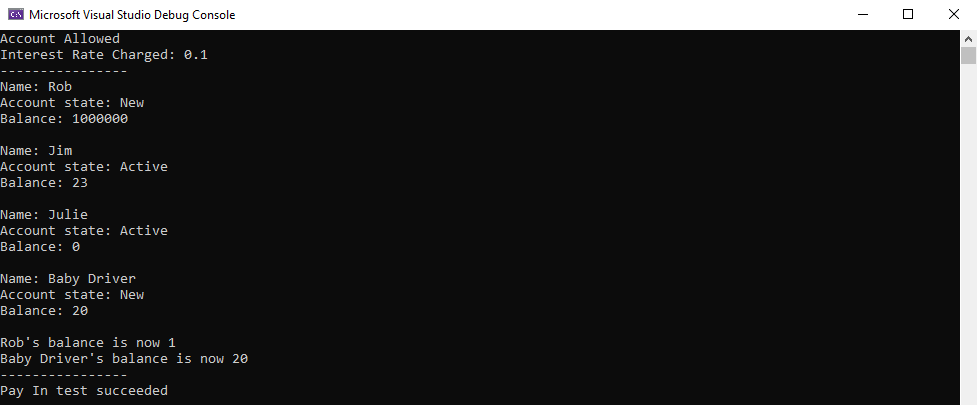

# Friendly Bank

My implementation of the Friendly Bank console application from Rob Miles' C# Yellow book 
-> a fantastic introduction to the C# language and the principles of Object Oriented Programming (OOP)

This program demonstrates the following aspects of OOP:
- enumerated types
- structs
- interfaces
- abstract classes
- static members
- overloading constructors / methods
- encapsulation
- abstraction
- inheritance

<h1 align="center">
   
  
</h1>
